# Reklamacja
Poniżej lista niedoróbek i błędów wykonawczych, które popełnił Pan w trakcie remontu mieszkania przy ulicy Fabrycznej 25/19 w Warszawie w ramach umowy o remont z dnia 2024-09-24. 

W ciągu 3 dni proszę odnieść się do każdego punktu i zaproponować rozwiązanie, oraz wskazać kiedy zostanie wykonana poprawka. Rozwiązanie proszę przesłać na adres email: szym.mysiak@gmail.com, w formie sms na nr 793 767 070.

# Lista wad
1. Oberwana toaleta. Miska WC opadała, można też ją było podnieść ręką do góry. W trakcie montażu zapewniał pan, że silikon to usztywni/ że to wina miski/ że to wina ścianki GK bez płytek/ że każda miska WC tak pracuje. Ostatecznie miska zaczęła opadać niebezpiecznie nisko, wyrywając przy tym farbę ze ściany razem z silikonem. Musieliśmy wezwać fachowca, który zdemontował miskę wc, usunął stary silikon, a następnie zamontował ją ponownie. Dowiedzieliśmy się, że montaż był przez pana przeprowadzony nieprawidłowo — trzpienie nie były ustawione we właściwej pozycji, w dodatku były zniszczone przez zbyt mocne przykręcanie. Uszczelka była zgnieciona, ale na szczęście udało się ją ponownie wykorzystać. Po ponownym zamontowaniu przez fachowca miska ani drgnie — ani w górę, ani w dół.
   * Przed poprawką: (widać nawet jak silikon się rozciągnął tworząc “szparę”):
   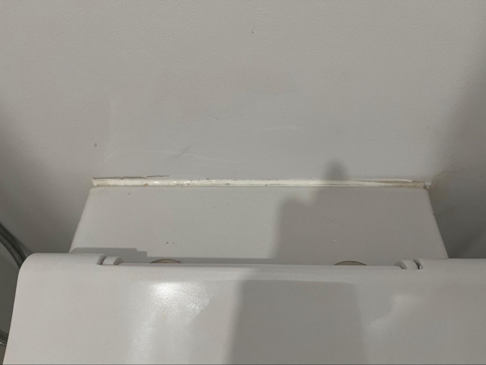
   * Po poprawce - wc nie jest opadnięte, krawędź miski ściśle przylega do ściany:
   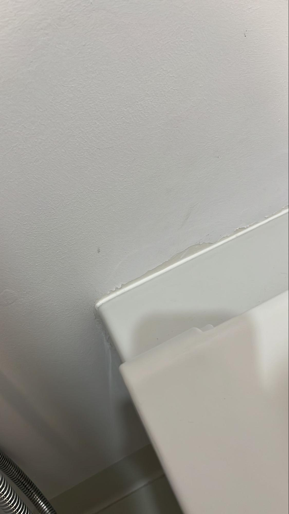
1. Nieprawidłowo zamontowana miska WC wyrwała farbę wokół silikonu. Farba jest też zerwana z prawej strony miski — zerwał ją pan taśmą malarską, która zabezpieczała silikon podczas pierwszego montażu.
   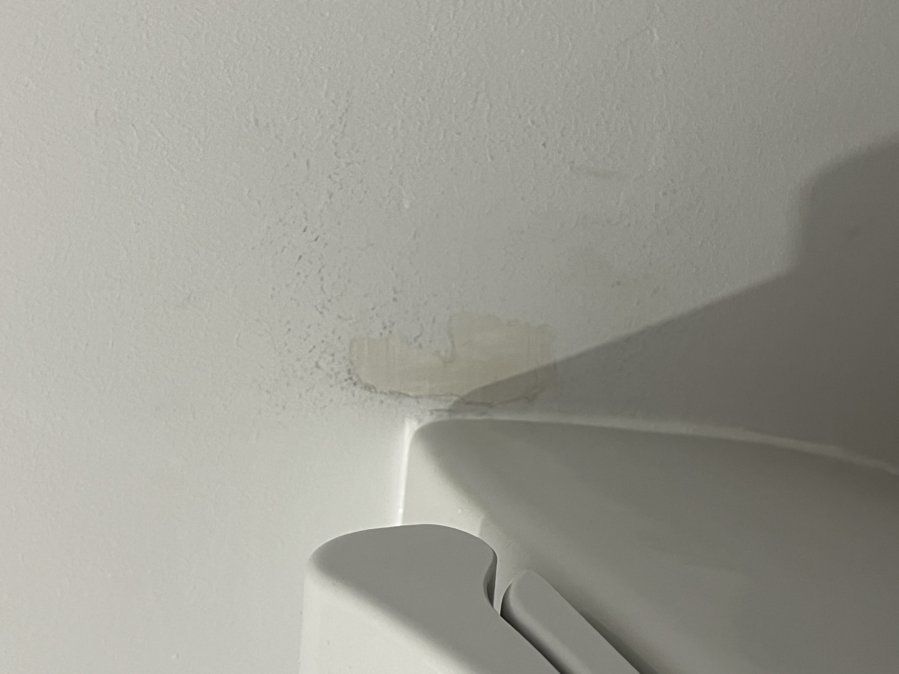
1. Ściany nie zostały prawidłowo przygotowane przed malowaniem. Okazało się, że farba miejscami odchodzi nawet od żółtej taśmy malarskiej — czego był pan naocznym świadkiem w trakcie montażu wc. Dotyczy to na pewno łazienki, przedpokoju, ściany pomiędzy kuchnią a balkonem. Miejscami są niedomalowania/tylko jedna warstwa farby:
   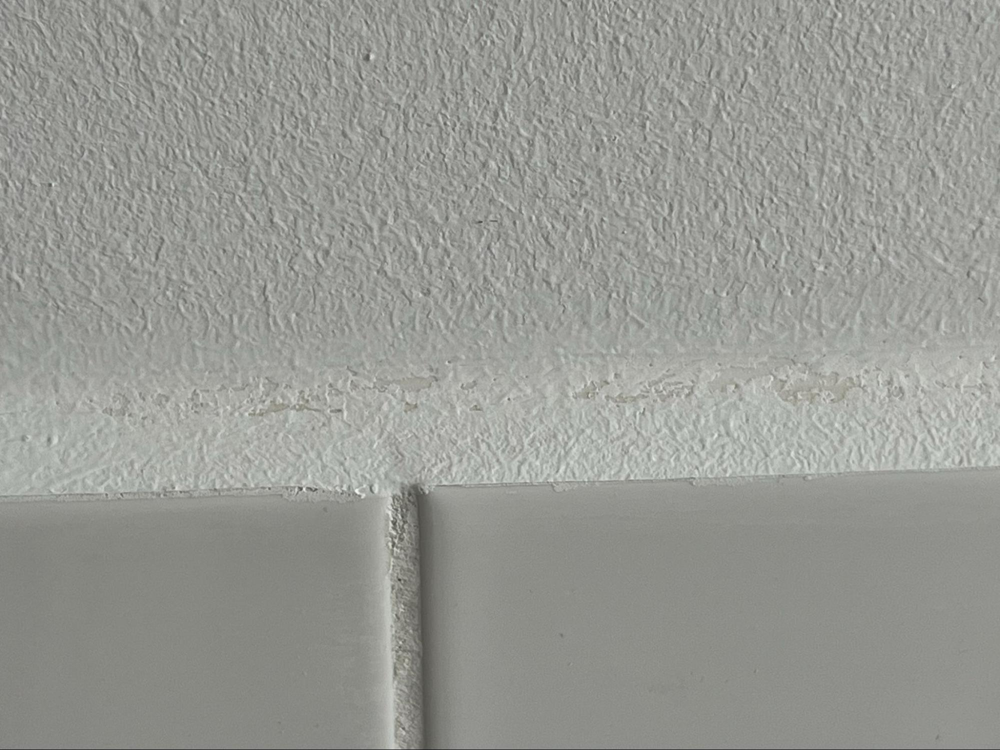
1. Fugi zostały wykonane niestarannie:
   *  W gorsecikach miejscami nie było fugi wcale, miejscami była tak cienka warstwa, że wypadała w trakcie mycia. Dotyczyło to około 20 miejsc. Poprawiali to grzecznościowo panowie od lastryko, bo istniało ryzyko zalania płyty OSB.
   Fugi pod prysznicem w jednym miejscu nie było wcale — załączałem zdjęcie w SMS. Podobnie jak w przypadku gorsecików, musiało to być poprawione przez innych fachowców, bo istniało ryzyko zalania sąsiada. Załączam zdjęcie w trakcie prac - ubytków było ponad 2 razy tyle ile widać na zdjęciu.
   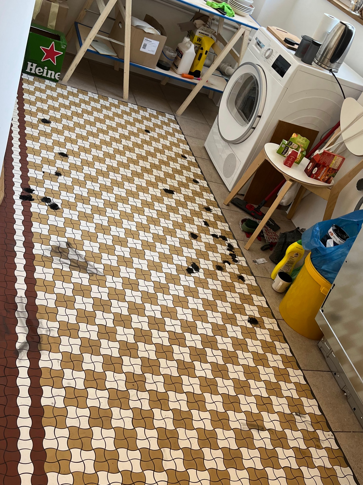 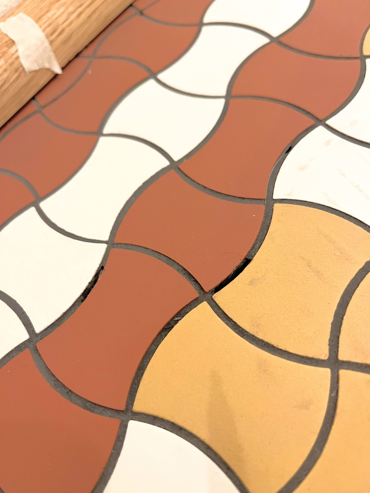
   * Fugi w cokołach miejscami są nieumyte (płytki zabrudzone fugą), miejscami ich brakuje (zwłaszcza w rogach), w 2 miejscach było jej zbyt mało i wypadła dosłownie po przetarciu szmatką.
   * Fugi gorsecików i cokołów nie zostały należycie umyte po układaniu. Zgodnie z [normą UNI-11493](https://www.google.com/url?q=https://bit.ly/437I2Tw&sa=D&source=editors&ust=1740829289042013&usg=AOvVaw2l1Jywu9Nr8XiOwvNSgs04) za mycie fug i okładzin po fugowaniu odpowiada osoba układająca okładziny. 
1. Gorseciki nie zostały przycięte na brzegach, tak jak było to ustalone w projekcie, do którego miał pan dostęp jeszcze przed podpisaniem umowy. 
1. Cztery gniazdka są na złej wysokości — niezgodnie z projektem.
1. Cokoły nie zostały przyklejone na prawidłowej wysokości. Pomijając krzywą wylewkę (wg umowy podłoga miała być wyrównana), same cokoły nie trzymają jednej wysokości. Różnice dochodzą do 2 cm. Przez to nie można estetycznie wylać mikrocementu.
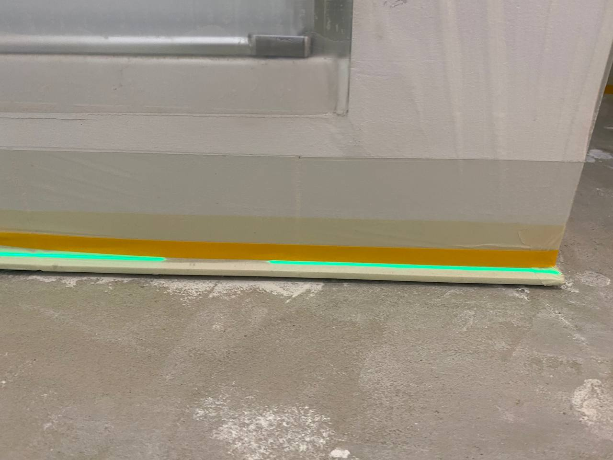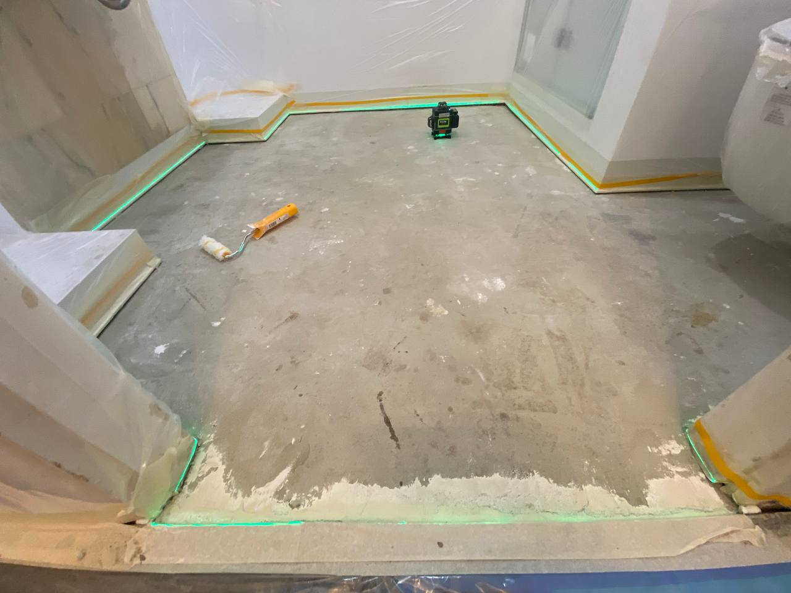
1. Kabina prysznicowa została zamontowana nieprawidłowo. Część wad odkryłem jeszcze w grudniu (odwrotnie przykręcona gałka, zła szerokość). W trakcie użytkowania wyszło, że kabina cieknie. Uszczelki dolne były zamontowane odwrotnie i źle przycięte. Jeden profil nie był zasilikonowany.
   Końcówka listwy dolnej była ucięta nożykiem/złamana: w trakcie montażu profilu kabiny nie została wyjęta zaślepka, w której miejsce wchodzi języczek końcówki listwy. Po założeniu profilu i zasilikonowaniu nie da się już wyjąć tej zaślepki bez dużej ilości pracy, więc zdecydował się pan uciąć języczek. Niestety bez niego kabina cieknie. Dowiedziałem się, że to częsty błąd montażystów, którzy nie czytają uważnie instrukcji.
1. Płyty OSB zostały zamontowane krzywo i na złym poziomie. Różnica poziomu wynosi ponad 2cm. To sprawiło że parkiet jest teraz “pod górkę”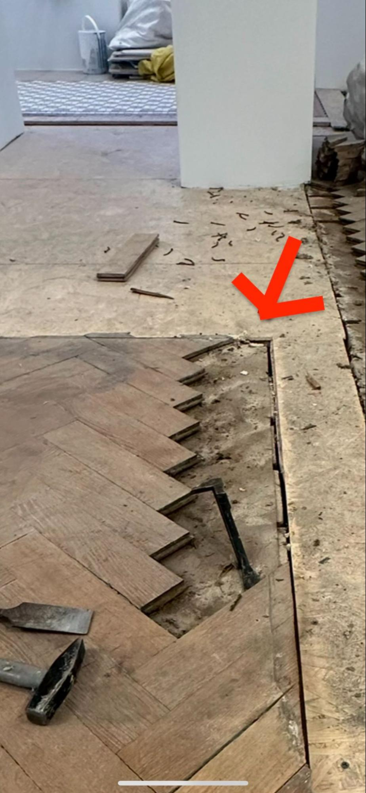
1. Akryle w wielu miejscach są popękane/mają pajączki. Nie ma reguły — są narożniki gdzie jest ok, są takie gdzie akryle są popękane. Z jednej strony drzwi balkonowych są pajączki, z drugiej nie. Producent winą obarcza zły dobór akrylu do farby lub skurcz wywołany niedostosowaniem czasu schnięcia do malowania.
1. Zasilikonował pan brud na parapecie. Wbrew pana zapewnieniom — nie schodzi.
1. 3 października kupił pan za 196,50 zł dwie płyty GK Norgips Neoflex przeznaczone do gięcia. Nie zostały one ostatecznie użyte. Co się z nimi stało? Czy zostały przywłaszczone?
1. Opaska świetlika w kuchni jest zawalona akrylem. Prosiłem pana, żeby poprawić drzwi, ale przemilczał pan fakt, że świetlik też pan zniszczył.
1. Narożniki są miejscami zbyt płytko osadzone - na mniej niż 1 mm.
1. Gładź przy opasce drzwi łazienkowych pękła samoistnie wzdłuż łączenia płyt jeszcze przed montażem drzwi. Ściana w łazience przeciwległa do wejścia również pękła po około 2 miesiącach.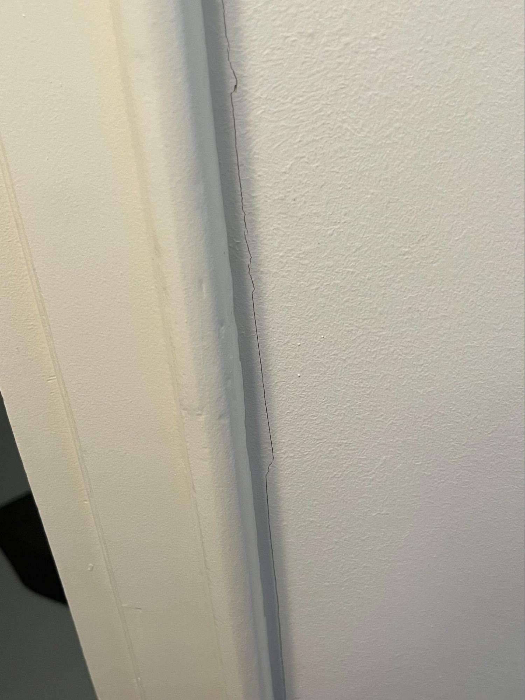 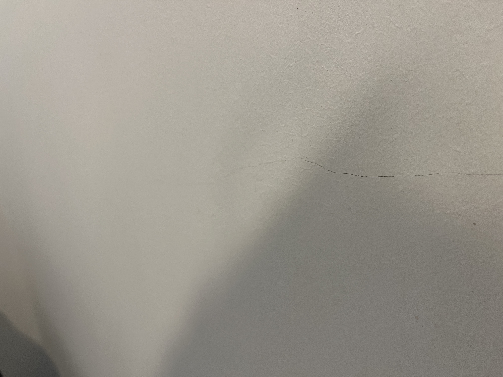
1. Malowanie wykonane niezgodnie ze sztuką — widać grubsze plamy farby, miejsca, gdzie wałek się nie kręcił, linie krawędzi wałka, niedomalowane miejsca etc.  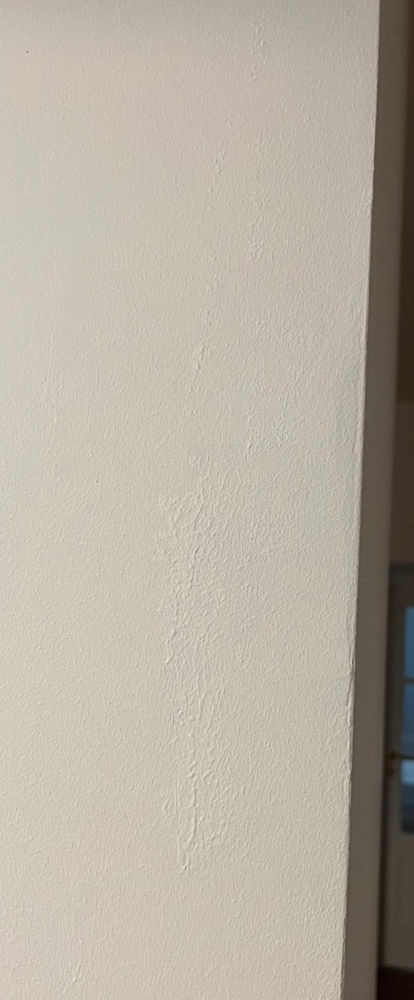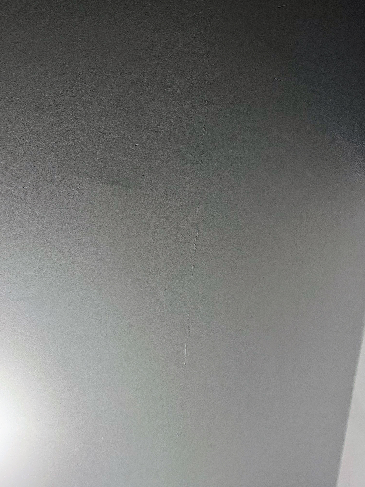
1. Gładzie nie zostały zgodnie ze sztuką. Żeby była jasność — w tym momencie odnoszę się tylko do ścian, które stawiał pan z GK od zera i miejsc, gdzie łatane były dziury po nowej instalacji elektrycznej. Zdecydowanie najgorzej jest na ścianach łazienki. Problem dotyczy też sufitu — wieczorem dokładnie widać, którędy biegną wiązki przewodów elektrycznych. Zdjęcia na kolejnej stronie.
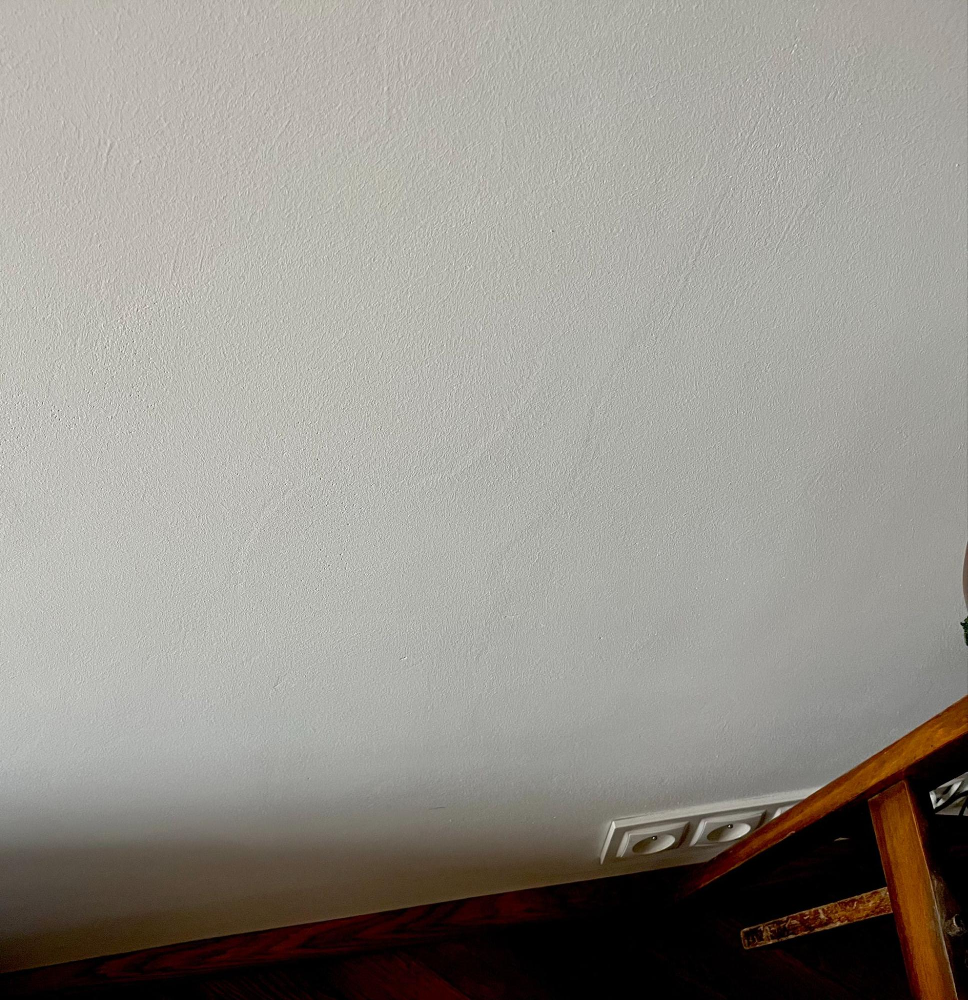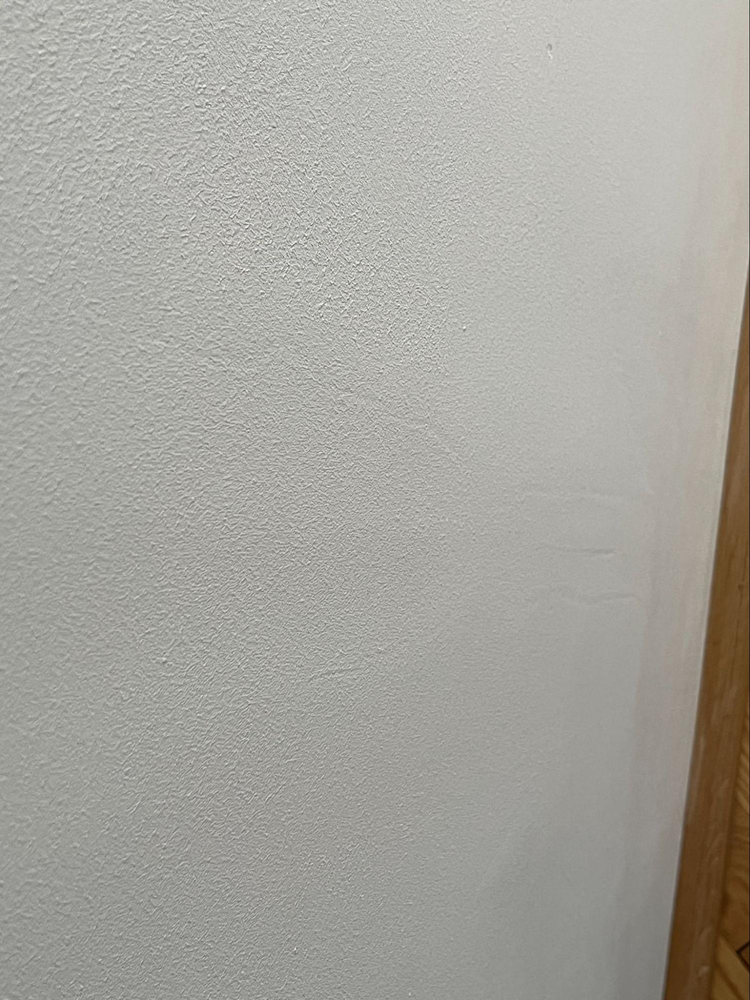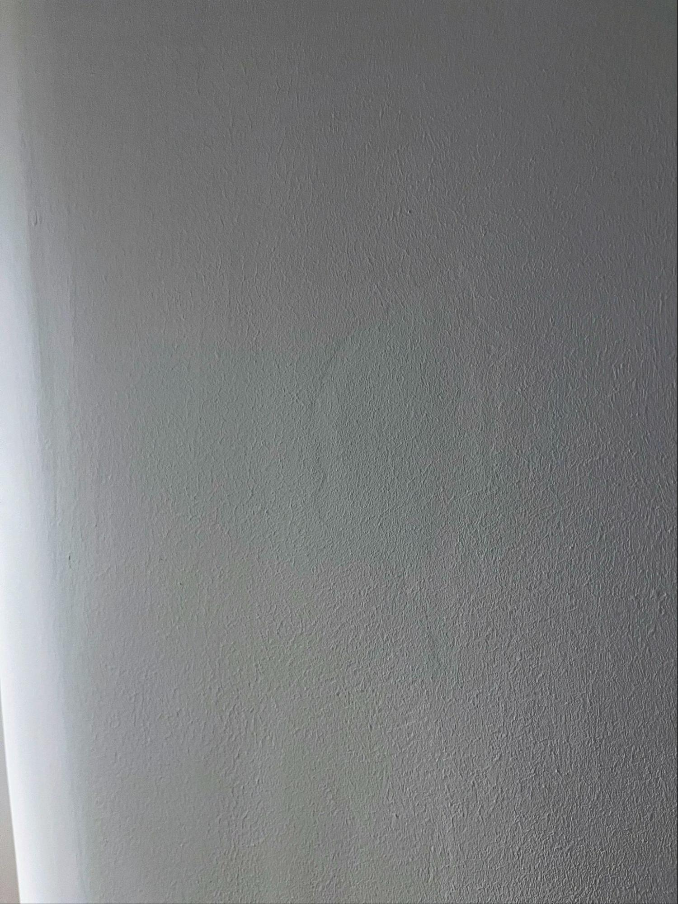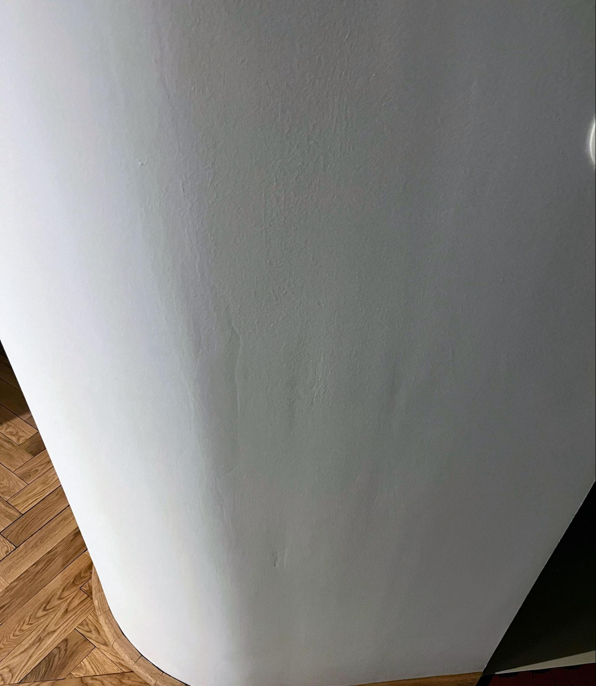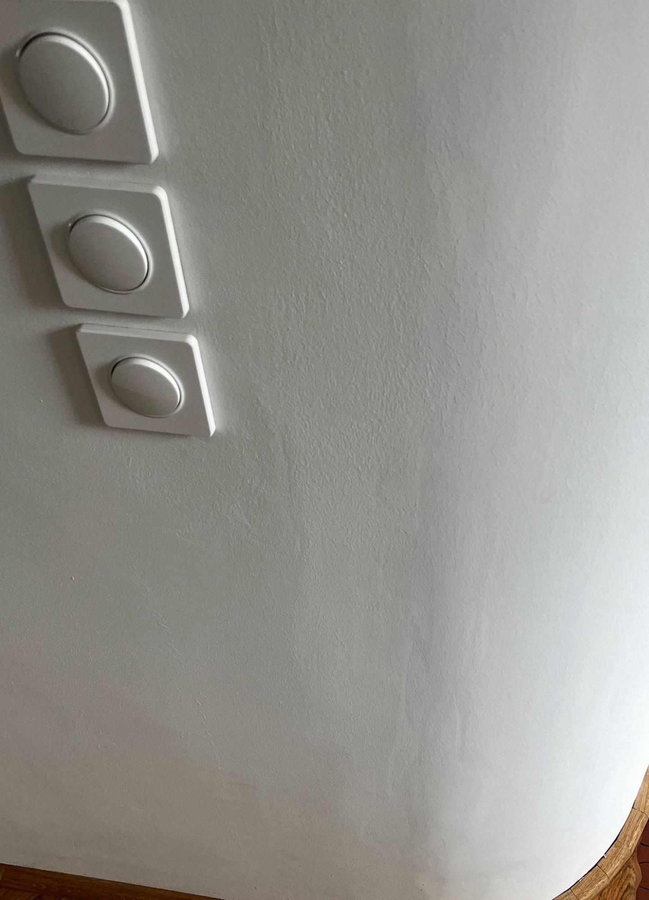
1. Zniszczył pan parkiet w 4 miejscach. Są 3 tłuste plamy: w gabinecie, sypialni i dużym pokoju, jedną z tych plam zrobił Pan na moich oczach. Zalał Pan też parkiet wraz z legarami (!) w miejscu obok pionu kanalizacyjnego - spowodowane było to obecnością miski WC, która była tam przez Pana ustawiona bez wystarczających zabezpieczeń. Dołączam zdjęcie, bo ostatnim razem jak rozmawialiśmy negował Pan taki fakt.
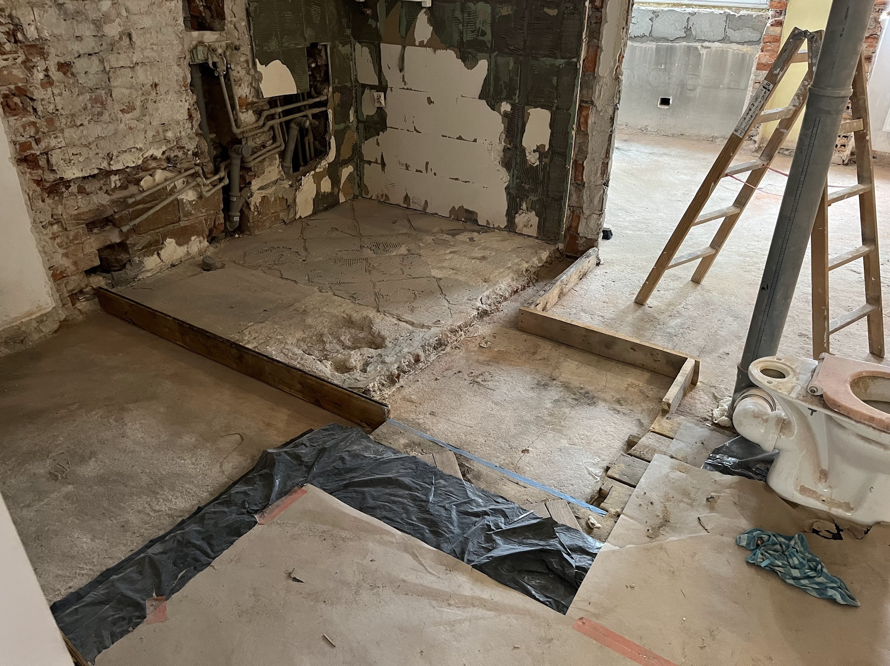  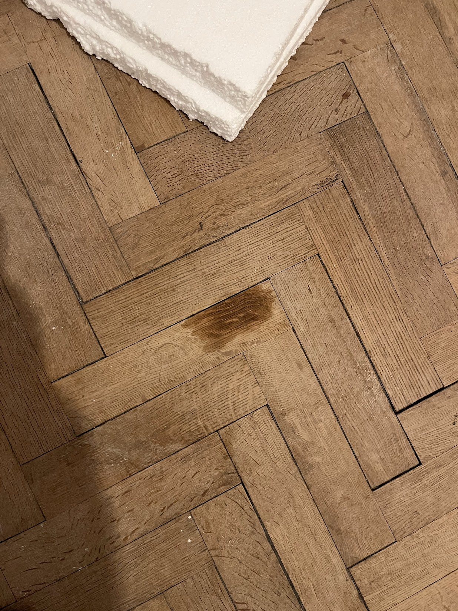 

